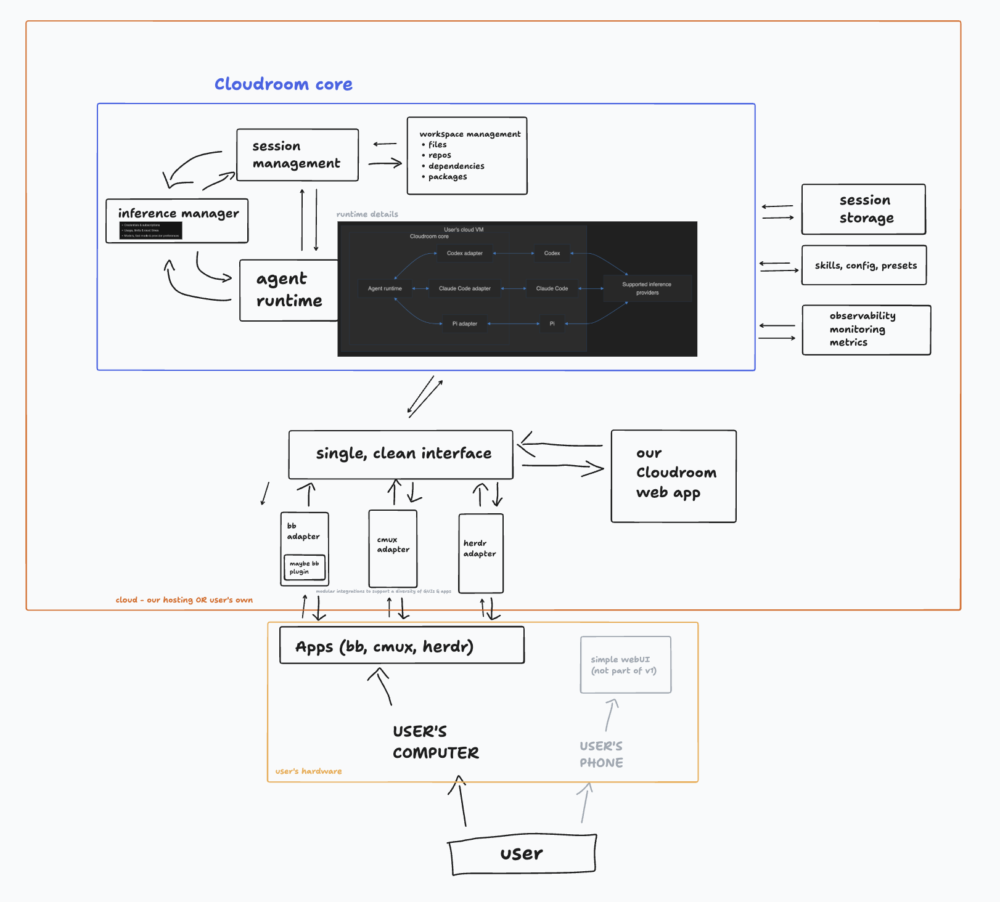

# Cloudroom core

A self-hostable Rust service that runs coding agents on your own Linux VM and saves their session history.
Supports Codex, Claude Code, Pi, and Cursor. Agents make their own model calls with your own logins.
One Cargo package; one service per VM. No Cloudroom account or hosted service is required.



*Architecture design. Some components and integrations shown are planned, not yet implemented.*

## Get started

- [Install on Ubuntu 24.04](docs/setup.md) with one script, or build from source.
- [HTTP API reference](docs/api.md): every endpoint, event, and error code.
- [Linux builds](https://github.com/davidondrej/cloudroom-core/releases): CI-tested binaries for each release.

## Security

- Agents run as a separate Linux user with no admin rights. The core removes every Linux privilege before an agent starts, so `sudo` does not work.
- Agents start with an empty environment. They cannot read the core's token, database password, or history files.
- Every API request needs a secret token; the installer generates a random 256-bit one. The API listens only on localhost unless you opt in behind an HTTPS proxy.
- History is saved to PostgreSQL outside the VM, over TLS with full certificate checks. Agents call model providers directly.
- Command Guard blocks a few catastrophic commands, such as deleting a home folder or formatting a disk.

Agents run without approval prompts and share one Linux user, so use one VM per trusted user.
See [cloudroom.dev/security](https://www.cloudroom.dev/security). Report vulnerabilities privately as described in [SECURITY.md](SECURITY.md).

## Desktop app

[Download the Cloudroom GUI beta](https://github.com/davidondrej/cloudroom-gui/releases) for Apple Silicon Macs, with a Linux alpha.
Downloads are public, but hosted cloud access remains invite-only. The core does not require the GUI.

## Build and test

Requires Rust 1.89+, Git, and the supported harness runtimes.

```sh
cargo build --locked --release
cargo test --locked --all-targets
```

Apply the two SQL files in `docs/database/` to a dedicated PostgreSQL database as its owner.
The service never applies migrations. Keep database and core credentials server-side.

- [Installation and workload protection](docs/storage.md)
- [Harness configuration and verification](docs/harnesses.md)
- [Session lifecycle](docs/session-lifecycle.md)
- [Diagnostics](docs/observability.md)
- [Dashboard API](docs/dashboard.md)

## Contributing

Issues and pull requests are welcome. Open an issue first for larger changes.
Accepted changes ship in the next release. Each release's notes list what changed.

This is pre-release software, not a claim that all planned features are complete.
Licensed under [Apache 2.0](LICENSE).
