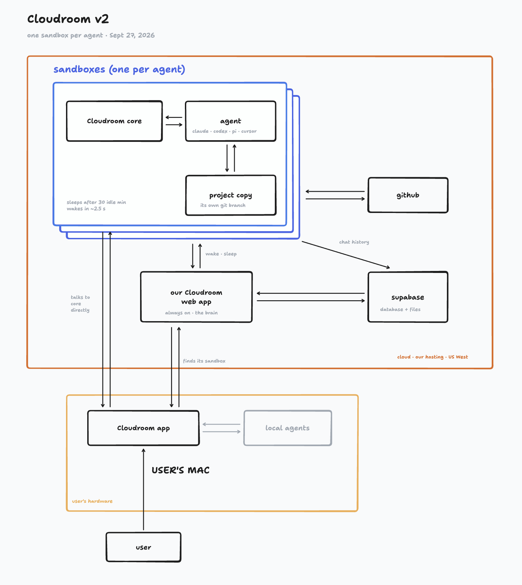

# Cloudroom core

[Website](https://www.cloudroom.dev) · [Desktop app](https://github.com/davidondrej/cloudroom-gui) · [Changelog](https://www.cloudroom.dev/changelog) · [Security](https://www.cloudroom.dev/security)

Your agents get their own room in the cloud.

Cloudroom core runs coding agents on your own Linux machine and saves their chat history. It powers the cloud side of the [Cloudroom app](https://github.com/davidondrej/cloudroom-gui), which runs Claude Code, Codex, and Pi on your Mac or in the cloud.

- Works with Codex, Claude Code, Pi, and Cursor.
- Agents use your own logins to call their models.
- One Rust service per machine. No Cloudroom account needed.

Don't want to host it yourself? Hosted Cloudroom is invite-only for now. [Join the waitlist](https://www.cloudroom.dev/#waitlist).



## Get started

- [Install on Ubuntu 24.04](docs/setup.md) with one script, on a VPS, a home server, or a spare laptop. A database on the same machine works.
- [Reach it from your laptop](docs/setup.md#reach-it-from-your-other-devices) with Tailscale, and [upgrade](docs/setup.md#upgrade) in place.
- [HTTP API](docs/api.md): every endpoint, event, and error code.
- [Linux builds](https://github.com/davidondrej/cloudroom-core/releases): tested binaries for each release.

## Security

- Agents run as a separate Linux user, with no admin rights and no `sudo`.
- Agents can't read the core's token, database password, or history files.
- Every API request needs a secret token. The API listens only on localhost unless you put it behind HTTPS.
- History is saved to PostgreSQL: on the same machine, or on another one over verified TLS.
- Command Guard blocks a few disastrous commands, like wiping a home folder.

Agents run without approval prompts, so give each trusted user their own machine.
Report vulnerabilities privately: see [SECURITY.md](SECURITY.md).

## Desktop app

[Download the Cloudroom app](https://github.com/davidondrej/cloudroom-gui/releases) for Apple Silicon Macs (Linux alpha). [Connect it to your own core](docs/setup.md#connect-the-desktop-app) with a URL and token, no account needed. The core also works without it.

## Build and test

Needs Rust 1.89+, Git, and the agent CLIs you want to run.

```sh
cargo build --locked --release
cargo test --locked --all-targets
```

Apply the two SQL files in `docs/database/` to a dedicated PostgreSQL database. The core never runs migrations itself.

More docs: [storage](docs/storage.md) · [harnesses](docs/harnesses.md) · [session lifecycle](docs/session-lifecycle.md) · [diagnostics](docs/observability.md) · [dashboard API](docs/dashboard.md)

## Contributing

Issues and pull requests are welcome. For big changes, open an issue first.
This is pre-release software. Licensed under [Apache 2.0](LICENSE).
